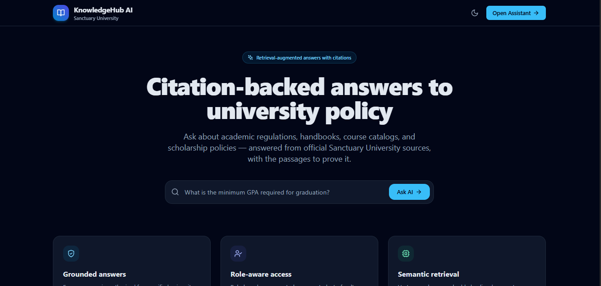
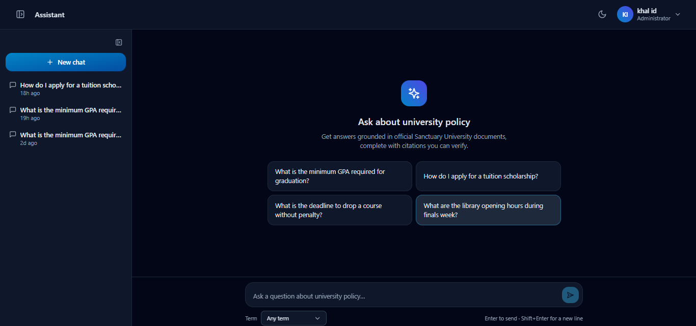
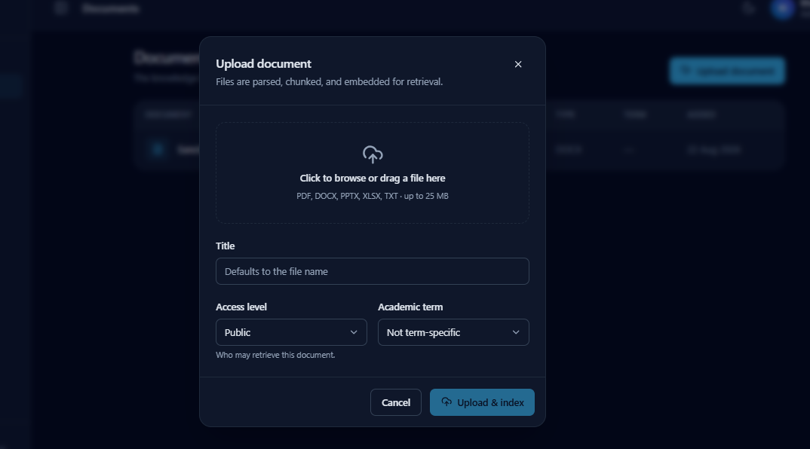
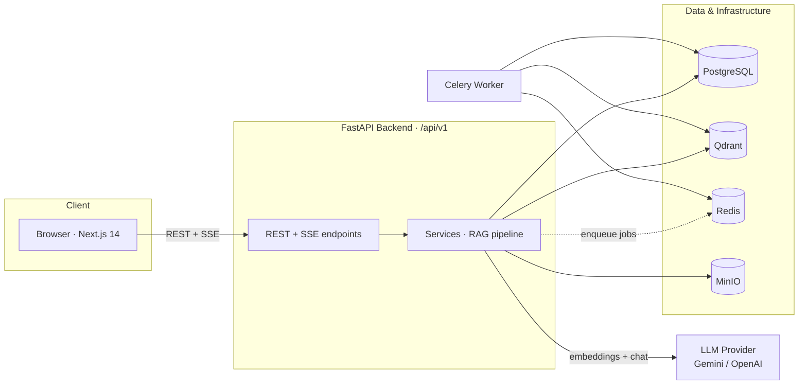
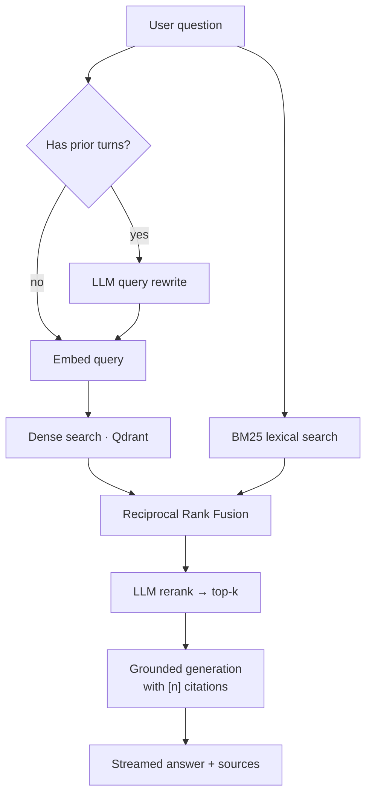

<div align="center">

# 🎓 KnowledgeHub AI

### The conversational knowledge assistant for Sanctuary University

Ask questions in plain language and get **accurate, citation-backed answers** drawn from
official university handbooks, policies, catalogs, and FAQs — with **role-based access**
so every user only ever sees what they're allowed to.


</div>

---

## 📖 Overview

Universities scatter their knowledge across dozens of disconnected places — student
handbooks, academic regulations, admission policies, course catalogs, scholarship pages,
departmental sites, and FAQs. Finding a reliable answer means knowing *which* document to
open and *which* exact terminology it uses. Different people get different answers to the
same question, and staff waste hours re-answering the same queries.

**KnowledgeHub AI** replaces that scavenger hunt with a single conversational interface.
It uses **Retrieval-Augmented Generation (RAG)**: before the language model writes a word,
the system retrieves the most relevant passages from *verified* university content, then
grounds its answer in them and **cites every source**. The model answers from institutional
knowledge — not from its own training — which keeps responses accurate and verifiable.

It is built as a **single-institution** platform (one university, one knowledge base) with
**role-based access control** woven through retrieval itself: a student and a dean can ask
the identical question and correctly receive different answers.

> **Guiding principle:** *Retrieval before generation — and every answer should be verifiable.*

---

## 📸 Screenshots

> 📌 **These are placeholders.** Save real captures into
> [`docs/screenshots/`](docs/screenshots) using the filenames listed there and they'll
> appear here automatically.

<div align="center">


*Landing page*

</div>

|  |  |
| :---: | :---: |
| <br/>*Streaming, citation-backed answers* | <br/>*Document upload & indexing* |
| <br/>*Admin: knowledge-source management* | *(dark mode supported throughout)* |

---

## ✨ Key Features

### 🤖 Conversational RAG
- **Grounded, cited answers** — the assistant answers only from retrieved passages and
  cites them inline as `[1]`, `[2]`; if the context doesn't cover the question, it says so
  instead of inventing an answer.
- **Token-by-token streaming** over Server-Sent Events for a responsive chat feel.
- **Multi-turn memory** — recent turns are threaded into both retrieval and generation, so
  follow-ups stay coherent.
- **Suggested questions**, per-message **👍 / 👎 feedback**, and full **conversation history**.

### 🔎 Hybrid retrieval pipeline
- **Dense** semantic search (Qdrant) **+ lexical** BM25 search, fused with **Reciprocal
  Rank Fusion (RRF)** — you get both meaning-based recall and exact-keyword precision.
- **LLM query rewriting** turns a follow-up ("what about part-time?") into a standalone
  query before retrieval.
- **LLM reranking** reorders the fused candidates by true relevance before generation.
- Every stage is tunable via environment variables (top-k, candidate-k, RRF constant, …).

### 🔐 Role-based access control (RBAC)
- JWT authentication (access + refresh tokens) with **bcrypt**-hashed passwords.
- A user's role gates **which document classifications they can retrieve** — enforced as a
  filter on *both* retrieval passes, so access control can't be bypassed by which retriever
  happens to surface a chunk.
- Upload/indexing is restricted to staff-level roles; role-gated navigation in the UI mirrors
  the server-side policy.

### 📚 Knowledge management
- **Upload & index** PDF, DOCX, and TXT documents — parse → chunk → embed → store — with a
  classification and optional academic term.
- **Knowledge-source CRUD** and a **document library** with pagination.
- Documents are tagged by **academic term** so a new semester's handbook can supersede last
  year's.

### 🎨 Modern web app
- **Next.js 14 App Router** + TypeScript + Tailwind, with **light/dark mode**, responsive
  layout (mobile conversation drawer), toasts, and polished loading/empty states.

---

## 🏗️ Architecture

Request flow follows a clean **API → Service → Repository → Model** layering on the backend,
with all database access async and isolated in repositories.



### RAG query flow



*RBAC is applied to **both** the dense and lexical passes as a classification filter, so a
user can never retrieve a chunk their role isn't allowed to see.*

### Ingestion pipeline

`upload → parse (pypdf / python-docx / txt) → token-aware chunking (tiktoken) → embed →
persist chunks in PostgreSQL + vectors in Qdrant`. Parsing runs in a threadpool so it never
blocks the event loop.

---

## 🧱 Tech Stack

| Layer | Technologies |
| --- | --- |
| **Frontend** | Next.js 14 (App Router), React 18, TypeScript 5, Tailwind CSS 3, Zustand, TanStack React Query, axios, lucide-react |
| **Backend** | FastAPI, Python 3.11+, SQLAlchemy 2.0 (async), Alembic, Pydantic v2 / pydantic-settings, Uvicorn |
| **AI / RAG** | OpenAI SDK (points at **Google Gemini** by default, or OpenAI), `tiktoken`, `rank-bm25`, LLM-based reranking & query rewriting |
| **Vector store** | Qdrant |
| **Datastores** | PostgreSQL 15, Redis 7, MinIO (S3-compatible object storage) |
| **Background jobs** | Celery (Redis broker/backend) |
| **Auth** | JWT (`python-jose`), bcrypt via `passlib` |
| **Infra** | Docker Compose, Nginx (reverse-proxy config) |
| **Testing** | pytest, pytest-asyncio, httpx |

> **LLM provider is pluggable.** The app talks to LLMs through the OpenAI SDK; `LLM_PROVIDER`
> selects whether that SDK points at Gemini's OpenAI-compatible endpoint (free tier — the
> default) or OpenAI proper. Embeddings default to `gemini-embedding-001` (3072-dim).

---

## 🔐 Access-control model

Roles map to the document classifications they may retrieve. This is the single source of
truth for retrieval-time access control (`app/retrieval/rbac.py`); the frontend mirrors it
for display only.

| Role | Can retrieve | Can upload / index |
| --- | --- | :---: |
| **Admin** | Public · Student · Faculty · Staff · Admin | ✅ |
| **Faculty** | Public · Student · Faculty | ✅ |
| **Staff** | Public · Student · Staff | ✅ |
| **Student** | Public · Student | — |

---

## 🚀 Getting Started

### Prerequisites
- **Docker** & **Docker Compose** (recommended path), or
- **Python 3.11+** and **Node.js 18+** for running the services directly.
- A **Google Gemini API key** — free from [Google AI Studio](https://aistudio.google.com/apikey).
  (Or an OpenAI key if you set `LLM_PROVIDER=openai`.)

### 1. Clone

```bash
git clone https://github.com/kvadah/sanctuary-university-rag-project.git
cd sanctuary-university-rag-project
```

### 2. Configure environment

```bash
cp .env.example .env
```

Open `.env` and set your key (the default provider is Gemini):

```dotenv
LLM_PROVIDER="gemini"
GEMINI_API_KEY="your-key-here"
```

> ⚠️ **Never commit real secrets.** `.env` is git-ignored — keep your key there, not in
> source. The committed defaults (`SECRET_KEY`, DB passwords, MinIO creds) are development
> placeholders and must be changed for any real deployment.

### 3. Run the full stack with Docker

```bash
docker-compose up --build
```

This starts everything: **backend** (`:8000`), **frontend** (`:3000`), **Celery worker**,
**PostgreSQL** (`:5432`), **Qdrant** (`:6333`), **Redis** (`:6379`), and **MinIO**
(`:9000`, console `:9001`).

Then apply database migrations (first run only):

```bash
docker-compose exec backend alembic upgrade head
```

Now open:
- **App:** http://localhost:3000
- **API docs (Swagger):** http://localhost:8000/docs

Register a user at `/register` in the app (or via `POST /api/v1/auth/register`), sign in, and
start asking questions. Upload a document or two first (as a staff-level user) so there's
something to retrieve.

---

### 🛠️ Local development (without Docker)

You still need Postgres, Qdrant, and Redis running — the easiest way is to start just those
via Docker:

```bash
docker-compose up postgres qdrant redis minio
```

**Backend** (from `sanctuary-rag/backend`):

```bash
python -m venv .venv && source .venv/bin/activate
pip install -r requirements.txt
alembic upgrade head                 # apply migrations
uvicorn app.main:app --reload        # dev server on :8000 (Swagger at /docs)
```

**Frontend** (from `sanctuary-rag/frontend`):

```bash
npm install
npm run dev                          # dev server on :3000
```

The frontend reads its API base URL from `NEXT_PUBLIC_API_URL`
(default `http://localhost:8000/api/v1`, set in `frontend/.env.local`).

---

## 📡 API reference

All routes are mounted under **`/api/v1`**. Full interactive docs at
**http://localhost:8000/docs**.

### Authentication
| Method | Endpoint | Description |
| --- | --- | --- |
| `POST` | `/auth/register` | Create a user account |
| `POST` | `/auth/login` | Obtain JWT access + refresh tokens |
| `GET`  | `/auth/me` | Current authenticated user |

### Chat & RAG
| Method | Endpoint | Description |
| --- | --- | --- |
| `POST` | `/chat/query` | Ask a question → RBAC-filtered, cited answer |
| `POST` | `/chat/query/stream` | Same, streamed as Server-Sent Events (`meta` → `delta` → `done`) |
| `GET`  | `/chat/conversations` | List your conversations (paginated) |
| `GET`  | `/chat/conversations/{id}` | A conversation with its full message history |
| `POST` | `/chat/feedback` | Record 👍 / 👎 on an assistant message |

### Documents
| Method | Endpoint | Description |
| --- | --- | --- |
| `POST` | `/documents/upload` | Upload & index a PDF/DOCX/TXT *(Admin / Faculty / Staff)* |
| `GET`  | `/documents` | List indexed documents (paginated) |

### Knowledge sources
| Method | Endpoint | Description |
| --- | --- | --- |
| `POST` | `/knowledge-sources` | Create a knowledge source |
| `GET`  | `/knowledge-sources` | List sources (paginated) |
| `GET`  | `/knowledge-sources/{id}` | Get one source |
| `PATCH` | `/knowledge-sources/{id}` | Update a source |
| `DELETE` | `/knowledge-sources/{id}` | Delete a source |

---

## ⚙️ Configuration

Key settings (see [`.env.example`](.env.example) for the full list). Defaults live in
`backend/app/core/config.py`.

| Variable | Default | Purpose |
| --- | --- | --- |
| `LLM_PROVIDER` | `gemini` | `gemini` (free tier) or `openai` |
| `GEMINI_API_KEY` / `OPENAI_API_KEY` | — | API key for the active provider |
| `DEFAULT_LLM_MODEL` | Gemini flash model | Chat/generation model |
| `DEFAULT_EMBEDDING_MODEL` | `gemini-embedding-001` | Embedding model |
| `EMBEDDING_DIM` | `3072` | **Must match** the embedding model's output size |
| `RAG_TOP_K` | `5` | Final chunks handed to the generator |
| `RAG_CANDIDATE_K` | `20` | Candidates each retriever returns before fusion |
| `RAG_RRF_K` | `60` | Reciprocal Rank Fusion damping constant |
| `RAG_RERANK_ENABLED` | `true` | LLM rerank of fused candidates |
| `RAG_QUERY_REWRITE_ENABLED` | `true` | LLM rewrite of follow-ups before retrieval |
| `CHUNK_MAX_TOKENS` / `CHUNK_OVERLAP_TOKENS` | `500` / `75` | Chunking window |

---

## 🧪 Testing

The backend ships with fast, service-free unit tests (FastAPI `TestClient` + pure functions —
no running database or vector store required):

```bash
cd backend
pytest                       # all tests
pytest tests/test_rbac.py    # a single file
```

Covered today: auth & password hashing, the RBAC policy, BM25 indexing, chunking, and RRF
fusion.

---

## 📁 Project structure

```
sanctuary-rag/
├── backend/                       # FastAPI application (Python 3.11+)
│   ├── app/
│   │   ├── api/                   # Routers: auth, chat, documents, knowledge_sources
│   │   ├── core/                  # config, async db, security (JWT/bcrypt), deps (RBAC)
│   │   ├── models/                # SQLAlchemy 2.0 ORM (user, knowledge, chat, audit)
│   │   ├── schemas/               # Pydantic v2 request/response models
│   │   ├── repositories/          # Async DB access (all queries live here)
│   │   ├── services/              # Business logic (auth, chat, ingestion, rag, ...)
│   │   ├── retrieval/             # Hybrid retrieval: vector_store, bm25, fusion, reranker, rbac
│   │   ├── llm/                   # LLM client, embeddings, generator, query_rewriter
│   │   ├── connectors/            # Document parsers (PDF / DOCX / TXT)
│   │   ├── utils/                 # Token-aware chunking
│   │   ├── workers/               # Celery app (background jobs)
│   │   └── main.py                # App factory, CORS, router mounting
│   ├── migrations/                # Alembic migrations
│   ├── tests/                     # pytest unit tests
│   └── requirements.txt
├── frontend/                      # Next.js 14 App Router (TypeScript + Tailwind)
│   └── src/
│       ├── app/                   # Routes: /, (auth)/login|register, (app)/chat|documents|admin|settings
│       ├── components/            # chat/, documents/, knowledge/, ui/, auth/
│       ├── hooks/                 # React Query hooks
│       ├── lib/                   # api (axios + SSE), types, constants, utils
│       ├── stores/                # Zustand auth store
│       └── providers/             # Auth, React Query, Theme (dark mode)
├── docker/                        # nginx.conf (reverse-proxy config)
├── docker-compose.yml
├── .env.example
└── README.md
```

---

## 📊 Project status

KnowledgeHub AI has a working end-to-end core. The table below is an honest snapshot.

**✅ Implemented**
- JWT auth + RBAC; role-gated document access enforced at retrieval time
- Hybrid retrieval (dense + BM25 → RRF → LLM rerank) with LLM query rewriting & multi-turn memory
- Grounded generation with inline citations; full-response **and** SSE streaming endpoints
- Document upload & ingestion (PDF / DOCX / TXT): parse → chunk → embed → Qdrant + Postgres
- Conversations, message history, and feedback
- Knowledge-source CRUD and a document library
- Full Next.js UI: landing, auth, chat, documents, admin, settings — with dark mode
- Dockerized stack, Alembic migrations, and unit tests

**🚧 Scaffolded / partial**
- **Celery worker** — the app is wired up, but ingestion currently runs synchronously in the
  request; offloading large jobs to the worker is the next step.
- **MinIO** object storage is provisioned; original-file archival is being wired in.
- **Admin analytics** — the admin area exists; rich analytics endpoints are pending.

**🗺️ Planned (per the design spec)**
- Automated connectors (website / database / FAQ) with scheduled re-indexing and indexing-job tracking
- Analytics & observability dashboard, and an evaluation harness
- Surfaced audit logging and document-version history in the UI
- Longer term: SSO, LMS/SIS integration, multi-language, GraphRAG

---

## 🩹 Troubleshooting

- **A browser CORS error on chat/upload usually masks a backend `500`.** Check the backend
  logs for the real exception rather than chasing CORS config.
- **Qdrant version mismatch → `500` on every retrieval.** Keep the Qdrant *server*
  compatible with the `qdrant-client` version in `requirements.txt` (the client uses the
  Query API, which older servers answer with `404`). The compose file pins a matching image.
- **Changing the embedding model/dimension** requires recreating the Qdrant collection —
  `EMBEDDING_DIM` must equal the model's output size, and existing vectors were written at
  the old size.

---

## 📚 Documentation

This implementation is guided by a detailed product & engineering specification (the numbered
`00_*`–`22_*` design documents in the parent directory), covering the product overview,
system & backend architecture, database design, auth, API design, the AI/RAG pipeline
(ingestion, embedding, retrieval, prompting, generation), evaluation & observability, the
frontend & admin dashboard, deployment, and testing strategy.

> The specs describe the intended system in full; this README documents what the codebase
> actually implements today, with the roadmap above bridging the two.

---

## 📄 License

No license file is included yet. Add one (e.g. **MIT**) before distributing publicly.
